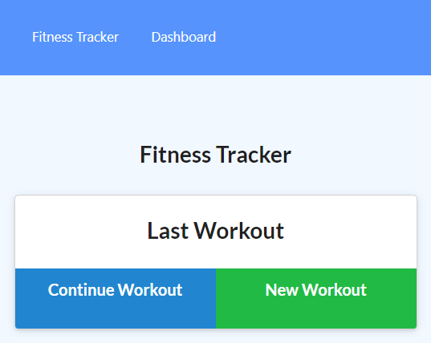

# Workout-Tracker

## Description

* As a user, I want to be able to view create and track daily workouts. I want to be able to log multiple exercises in a workout on a given day. I should also be able to track the name, type, weight, sets, reps, and duration of exercise. If the exercise is a cardio exercise, I should be able to track my distance traveled.

## Deployment 

[Workout-Tracker](https://github.com/Bjavillo1059/Workout-Tracker)

## Technology used

- HTML
- CSS
- JavaScript
- MongoDB
- Mongoose
- Express.js

## Contact Info

please contact me at [brandonjavillo@gmail.com](brandonjavillo@gmail.com)

## Process

<!-- - NavBar created with links and supporting documents -->
